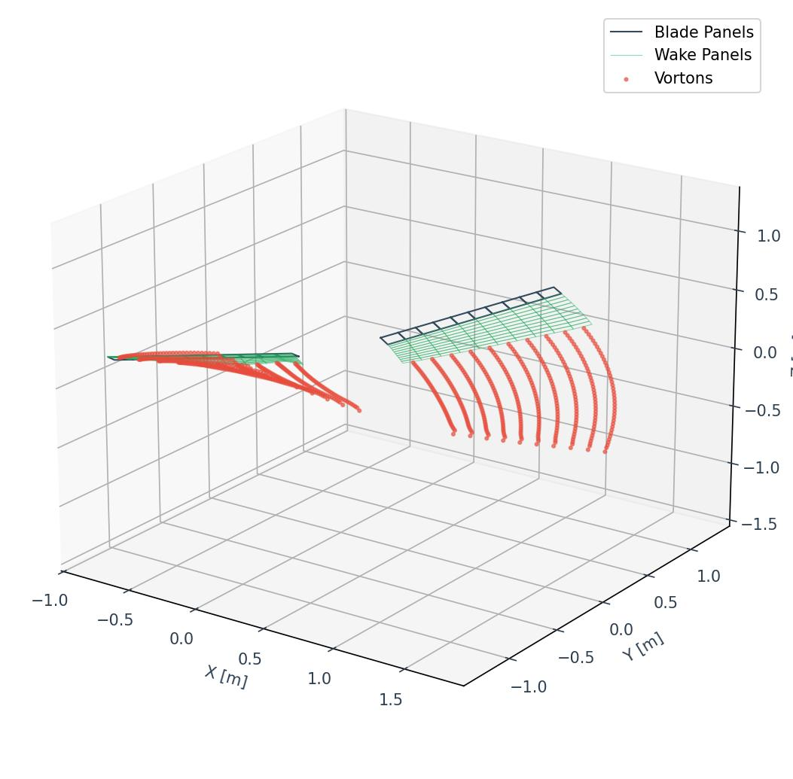

# Unsteady Vortex Lattice Method (UVLM) Solver

An unsteady vortex lattice aerodynamic solver for rotor blades, written in modern C++ utilizing the `Eigen` library for fast linear algebra and `vtu11` for high-fidelity VTK output.



## Features
- **Unsteady Aerodynamics**: Computes unsteady lift, drag, and moment using the Unsteady Vortex Lattice Method (UVLM).
- **Free-Wake Advection**: Full Biot-Savart advection of trailing wake panels and shed vortons (discrete vortex particles).
- **High-Fidelity VTK Export**: Generates `.vtu` unstructured grids containing:
  - `Velocity` (3D Vector field) at all blade, wake panel, and vorton points.
  - `Force` (3D Vector field) on all blade panel cells.
  - `Gamma` (Circulation scalar) on all cells.
  - `EntityType` (0 for Blade, 1 for Wake Panel, 2 for Vorton particle).
- **Format Stability**: Outputs in `Base64Inline` binary format to guarantee glitch-free parsing in modern ParaView versions.

## Codebase Architecture
```
UVLM/
├── assets/           # Media and image files for documentation
├── externals/        # Header-only dependencies (Eigen 3.4.0, vtu11)
├── include/          # Header files (.h)
│   ├── IO/           # VTK formatter and config parser
│   ├── aerodynamics/ # Wake and solver logic
│   └── mesh/         # Blade mesh and panel geometry definitions
├── src/              # C++ Source files (.cpp)
├── config.vlm        # Simulation parameters and flight conditions
├── Makefile          # Build system configuration
└── README.md         # Documentation
```

## Getting Started

### Prerequisites
A modern C++ compiler supporting C++20 (e.g., `g++-15` or equivalent clang) and OpenMP for parallel advection processing.

### Building
Compile the project using `make`:
```bash
make
```

### Running
Execute the simulation:
```bash
DYLD_LIBRARY_PATH=/Users/omarkahol/opt/openmp/lib ./output/main
```
Simulation outputs will be saved sequentially as `output/mesh_*.vtu`, alongside a CSV containing integrated force values over time.

## ParaView Visualization Guide
1. **Load data**: Open the generated `mesh_*.vtu` files in ParaView.
2. **Visualize Forces**: Apply the **Glyph** filter to the blade surfaces. Set the Glyph vector array to `Force` and set Glyph mode to `All Points` to draw 3D arrows indicating the direction and magnitude of the aerodynamic forces.
3. **Visualize Wake Flow**: Select the `Velocity` array to visualize the induced flow field on the wake panels and vortons. Apply the **Glyph** filter using `Velocity` to see the flow stream directions.
